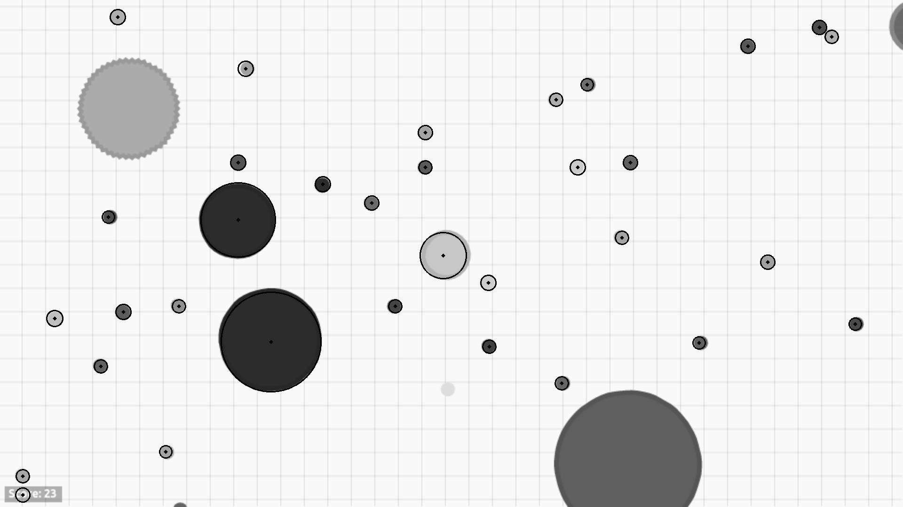
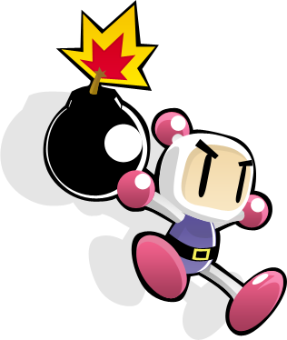

# The History of the project

## Inspiration

  <iframe width="420" height="315" src="https://www.youtube.com/embed/qv6UVOQ0F44" frameborder="0" allowfullscreen></iframe>

With the entire team having a love of video games as well as an invested interest in learning about machine learning, the natural course of action seemed clear to us: build a bot!

Most of the machine learning video game playing bot seemed to focus on classic arcade games. Wanting to do something a little different, we went with one of our favorite browser games: Agar.io.

## First Steps

Initially we tried to image process the screen to get the information we needed but this proved too difficult, as it took too long for such a fast paced game and we felt it was too far off and distracting from our goal of machine learning.

## Pivot

After spending a while working through problems we decided to take a step back and look at the bigger picture. We compared the core features of Agar.io, the game we wanted to bot to Super Mario World, one of the best bots we had seen online. Upon doing so we found several crucial differences:

1. Pacing
Agar.io is a very fast paced game whereas Super Mario World can be played at leisure (to some extent)

2. Movement Options
Agar.io uses the mouse to move, giving it a wide range of possible commands to weight. Super Mario has very limited number, especially when you take out moving backwards.

3. Goals
Agar.io's primary objective of survive is difficult to gauge as both survival and growth must be balanced. In Super Mario, distance into the level is a constant sign of progress.

4. Data Collection
Easily the most important reason as to why Agar.io was so difficult to work with. Unlike Super Mario, which has well documented memory locations and countless open source remakes, Agar.io's data on players, enemies, and other factors is on the server side and inaccessible. Being newer, already free to play, and multiplayer, there were no up-to-date remakes where the information we needed was readily accessible.

So we changed to Bomberman

## Learning

We picked Bomberman (and realized why old arcade games were so popular for these machine learning bots) because it fit all the criteria Agar.io did not. It has a relatively adjustable pace, limited control scheme, a clear goal, and because we are using a pygame remake, we can take the game data directly from the code.
